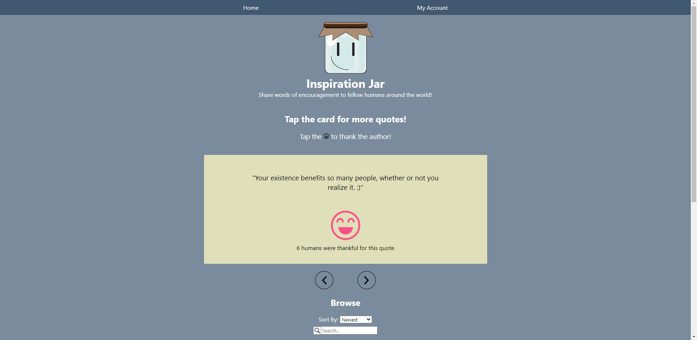

<p align="center">
  <a href="https://github.com/AjayLiu/inspiration-jar">
    
  </a>

  <h3 align="center">Inspiration Jar</h3>

  <p align="center">
    A platform for humans around the world to share and read words of encouragement! 
    <br />
    <a href="https://inspiration-jar.ajayliu.com"><strong>Website »</strong></a>
</p>


<!-- TABLE OF CONTENTS -->
<details open="open">
  <summary>Table of Contents</summary>
  <ol>
    <li>
      <a href="#about-the-project">About The Project</a>
      <ul>
        <li><a href="#built-with">Built With</a></li>
      </ul>
    </li>
    <li>
      <a href="#getting-started">Getting Started</a>
      <ul>
        <li><a href="#prerequisites">Prerequisites</a></li>
        <li><a href="#installation">Installation</a></li>
        <li><a href="#development">Development</a></li>
        <li><a href="#deployment">Deployment</a></li>
      </ul>
    </li>
    <li><a href="#license">License</a></li>
    <li><a href="#contact">Contact</a></li>
    <li><a href="#acknowledgements">Acknowledgements</a></li>
  </ol>
</details>


<!-- ABOUT THE PROJECT -->
## About The Project

</img>

I got the <em>inspiration</em> to make this project when I gave my dad a similar gift for our Christmas 2020 gift exchange. I wrote words of encouragement on little pieces of paper and put them in a jar, which you can take and read if you need.

### Built With
Frontend:
* [Next.js](https://nextjs.org/)
* [React](https://reactjs.org/)
* [SCSS](https://sass-lang.com/)

Backend:
* [Express.js](https://expressjs.com/)
* [Node.js](https://nodejs.org/en/)
* [PostgreSQL](https://www.postgresql.org/)


<!-- GETTING STARTED -->
## Getting Started

Here is a guide if you want to clone my website and modify it for yourself, all the way to deployment.

### Prerequisites

* [yarn](https://yarnpkg.com/)
* [git](https://git-scm.com/)

### Installation

1. Clone the repo
   ```sh
   git clone https://github.com/AjayLiu/inspiration-jar.git
   ```
2. Install packages
   ```sh
   yarn
   cd client
   yarn
   cd ../server
   yarn
   ```
3. Create a PostgreSQL databse (I used Heroku)
4. Create a `.env` file in the /server folder and fill in the following info for the backend to function properly (PG = postgres)
   ```
   PG_HOST =
   PG_DATABASE =  
   PG_USER = 
   PG_PORT = 
   PG_PASSWORD = 

   GOOGLE_CLIENT_ID = 
   GOOGLE_CLIENT_SECRET = 

   SESS_NAME = (doesnt really matter)
   SESS_SECRET = (some random gibberish)

   DISCORD_WEBHOOK_URL = 

   ADMIN_EMAIL =
   ```


### Development

To run the development server
   ```sh
   yarn dev
   ```
Then head over to localhost:3000

### Deployment

1. Publish the site on Heroku using continuous git integration.   
2. Enter in the environment variables (`.env`) in Heroku via [Heroku's CLI](https://devcenter.heroku.com/articles/config-vars) or through the website dashboard.

<!-- LICENSE -->
## License

Distributed under the MIT License. See `LICENSE` for more information.


<!-- CONTACT -->
## Contact

Ajay Liu - contact@ajayliu.com

Project Link: [https://github.com/AjayLiu/inspiration-jar](https://github.com/AjayLiu/inspiration-jar)


<!-- ACKNOWLEDGEMENTS -->
## Acknowledgements
* [Fuse.js for the search bar (fuzzy search)](https://www.vantajs.com/)
* [Passport.js for Google OAuth Login](https://www.passportjs.org/)
* [connect-pg-simple](https://www.npmjs.com/package/connect-pg-simple)
* [sweetalert2](https://sweetalert.js.org/)
